# HLS PLUGIN

---

<picture>
 <source media="(prefers-color-scheme: dark)" srcset="https://raw.githubusercontent.com/Blazemeter/jmeter-bzm-commons/refs/heads/master/src/main/resources/dark-theme/blazemeter-by-perforce-logo.png">
 
</picture>


The HLS protocol provides a reliable, cost-effective means of delivering continuous and long-form video over the Internet. It allows a receiver to adapt the bitrate of the media to the current network conditions, in order to maintain uninterrupted playback at the best possible quality.

Likewise, trying to provide a wider spectrum of protocols to support videos streaming and video on demand, the plugin also recognizes MPEG-DASH links automatically, without having to point it out in the interface, supporting the downloads of manifests and segments with a predefined resolution and bandwidth.
 
For more information related to HLS, please refer to the  [wikipedia page](https://en.wikipedia.org/wiki/HTTP_Live_Streaming) or to the [RFC](https://tools.ietf.org/html/rfc8216) and, for MPEG DASH, please refer to the [wikipedia page](https://en.wikipedia.org/wiki/Dynamic_Adaptive_Streaming_over_HTTP) or to the [ISO](https://standards.iso.org/ittf/PubliclyAvailableStandards/c065274_ISO_IEC_23009-1_2014.zip).

Currently, the project uses a [fork](https://github.com/Blazemeter/hlsparserj) of the [HLSParserJ](https://github.com/Comcast/hlsparserj) library to parse the HLS playlists and a [fork](https://github.com/Blazemeter/mpd-tools) of [MPD-Tools](https://github.com/carlanton/mpd-tools) for MPEG-DASH manifest and segments.

**NOTICE**

In future releases, the plugin will be named "Video Streaming Plugin" instead of "HLS Plugin", following the same desire to cover a wider range of protocols.

#### In an HTTP Live Streaming process:

- The audio/video to be streamed is reproduced by a media encoder at different quality levels, bitrates and resolutions. Each version is called a variant.
- The different variants are split up into smaller Media Segment Files.
- The encoder creates a Media Playlist for each variant with the URLs of each Media Segment.
- The encoder creates a Master Playlist File with the URLs of each Media Playlist.
To play, the client first downloads the Master Playlist, and then the Media Playlists. Then, they play each Media Segment declared within the chosen Media Playlist. The client can reload the Playlist to discover any added segments. This is needed in cases of live events, for example.

Notice that the automatic recognition of the HLS protocol is based on the requirement of the URL extension of the Master playlist link, which must have ".m3u8" on it, as specified on the [ISO regulation](https://tools.ietf.org/html/rfc8216#section-4).

#### In a Dynamic Adaptive Streaming over HTTP Live Streaming process:

- The encoder creates a Manifest which contains all the Periods, among Base URLs and the Adaptation Sets to do the filtering, based on resolution, bandwidth and language selector.
- The plugin is coded, so it will download the segments, for each Adaptation Set selected, consecutively, instead of doing it in parallel.
- The plugin will update the manifest based on the ```timeShiftBufferDepth``` attribute of MPD.

Notice that, just like is done for HLS, the recognition on this protocol is based on the URL of the Manifest, which should contain ".mpd" on it. In cases, it doesn't meet this requirement, and the url don't contain ".m3a8", it is going to be considered a MPEG-DASH as well.

## How the plugin works

### Concept

This plugin solves the HLS complexity internally. It gets the master playlist file, chooses one variant and gets its media playlist file, the segments, etc. The plugin simulates users consuming media over HLS supporting different situations: stream type, playback time, network bandwidth and device resolution.

Same occurs for MPEG Dash. It gets the Manifest file from the url, chooses an Adaptive set for Media, Audio and Subtitles based on availability, stream type, playback time, network bandwidth and device resolution.


Here is what the Sampler looks like:

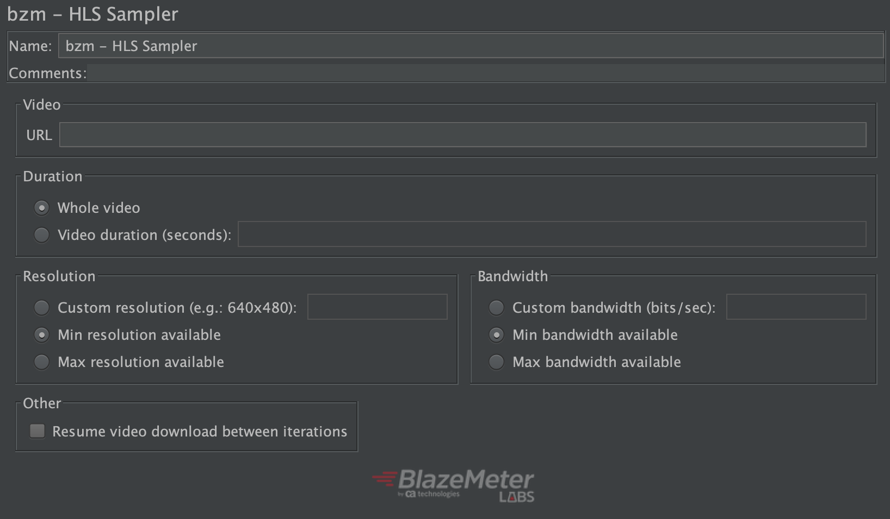

### To create your test

- Install the HLS plugin from the Plugins Manager
- Create a Thread Group.
- Add the HLS Sampler Add -> Sampler -> bzm - Streaming Sampler

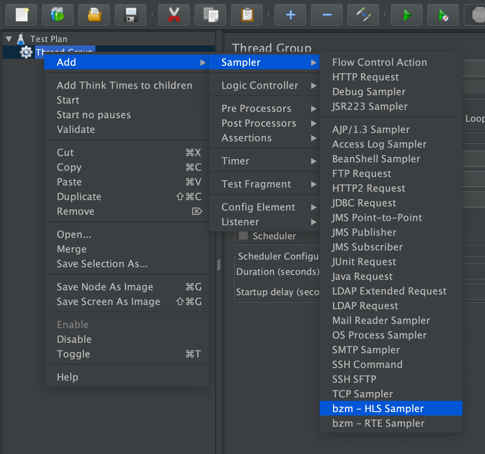

After that you can add assertions, listeners, etc.

### HLS Sampler configuration

#### Master playlist URL

Set the link to the master playlist file.  
A new feature was added which is the 'Load Playlist' button. Its purpose is to load all the available variants for the given Master url, such as Audio, Subtitle, Bandwidth and Resolutions on its respective Combo Box
where the user can choose the desired option. Also, this combo boxes can be edited so JMeter variables can be inserted.

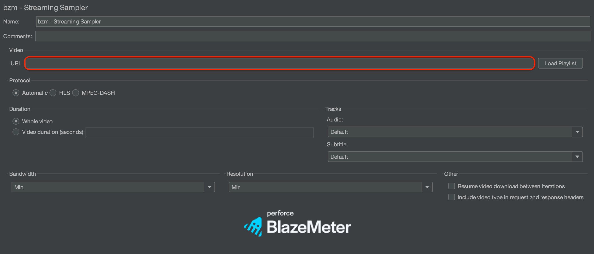

#### Protocol

Set the protocol you want to test or let the plugin to automatically detect it.

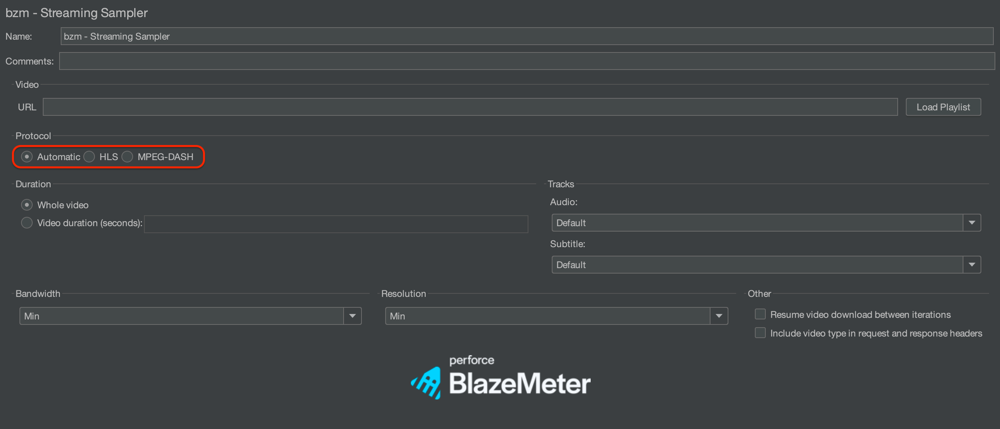

#### Duration

Set the playback time to either the whole video, or a certain amount of seconds.

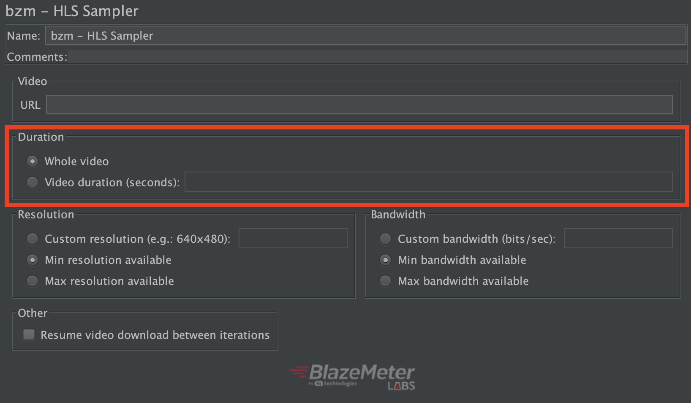

#### Start from live edge

Optional checkbox (**Start from live edge**) next to the playback duration options.

When enabled, the sampler starts **near the live edge** on **live / EVENT** media playlists (those without a fixed end): it skips segments at the beginning of the window so the first downloaded segment reflects recent media—roughly within the last **three target durations** of segment time (`#EXT-X-TARGETDURATION`), consistent with [RFC 8216 §6.3.3](https://datatracker.ietf.org/doc/html/rfc8216#section-6.3.3). 

> [!NOTE]
> **VOD** playlists are unchanged (playback still starts from the beginning). 
> The option applies to **HLS only**; it is **disabled** when **Protocol** is MPEG-DASH.

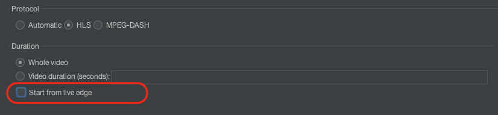

#### Audio & subtitles tracks

As stated before you can set default values or choose a specific alternative audio or subtitle track option from the ones displayed in the combo boxes once you load the playlist.

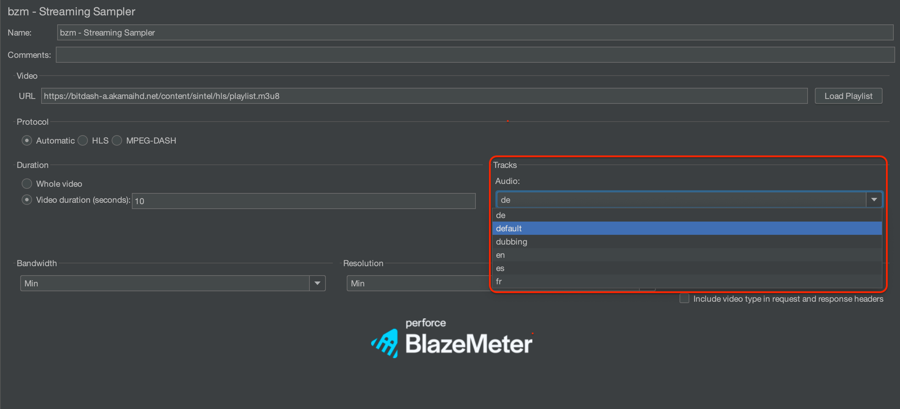

#### Bandwidth & resolution

Select the bandwidth and resolution criteria to be used to select a particular variant of the video. As bandwidth and resolutions are related, once you choose a specific bandwidth, the resolution options will be restrained in order to show only the ones that are compatible with each specific bandwidth. However, 'min' and 'max' options are always available.

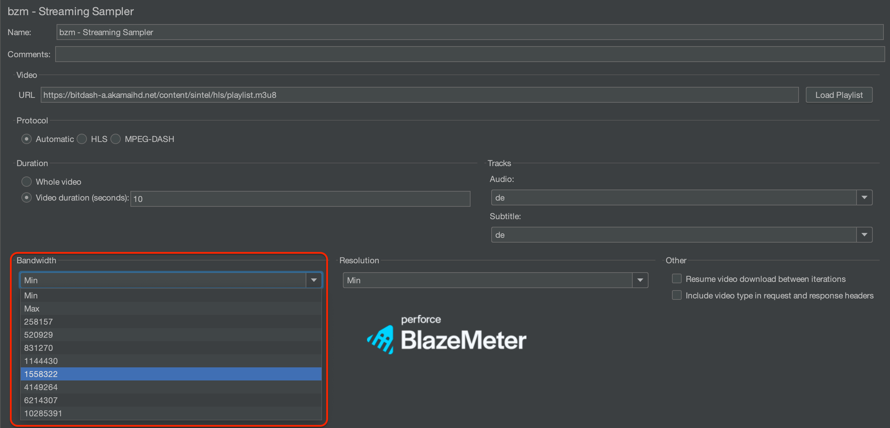

#### Resume video downloads

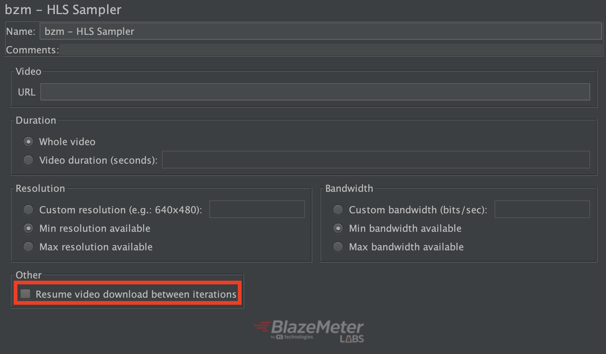

Specify whether you want the playback to be resumed or not between. If you leave the default value, then the plugin will restart playback from the beginning of the stream on each iteration.

#### Add video type to request and response headers

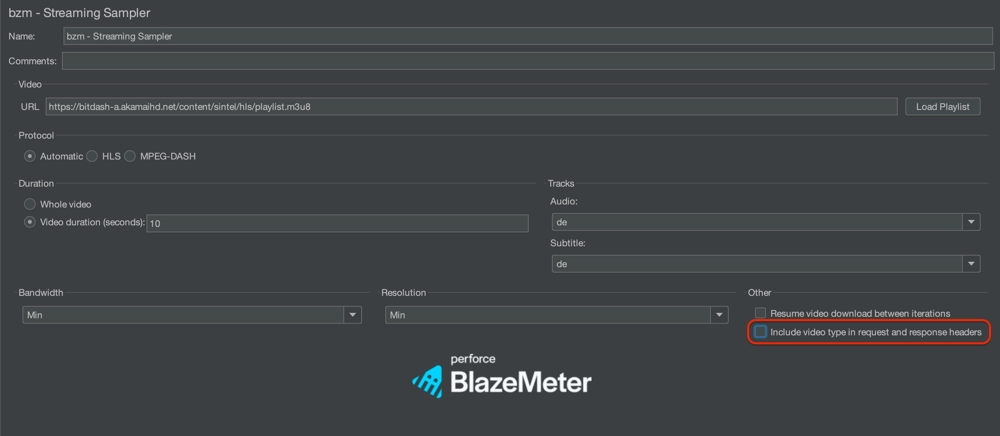

Specify whether you want the video type to be added to request and response headers for the playlist/manifest requests. The type will allow you to apply assertions if the video is a VOD or Live stream.

## Results

You can set listeners to evaluate the results of your tests. The View Results Tree Listener displays the resultant samples for the HLS samplers so, you can inspect how the requests and responses worked. It will display each one of the samples with the associated type (master playlist, media playlist or video segment) to easily identify them.

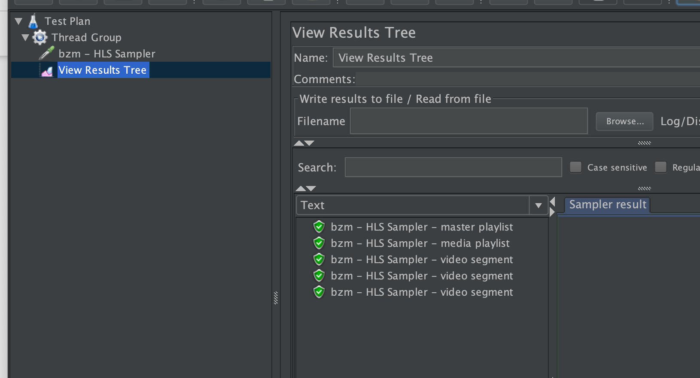

The sampler will automatically add an `X-MEDIA-SEGMENT-DURATION` HTTP response header which contains the media segment duration in seconds (in decimal representation). This value can later be used to perform analysis comparing it to the time taken in the associated sample.

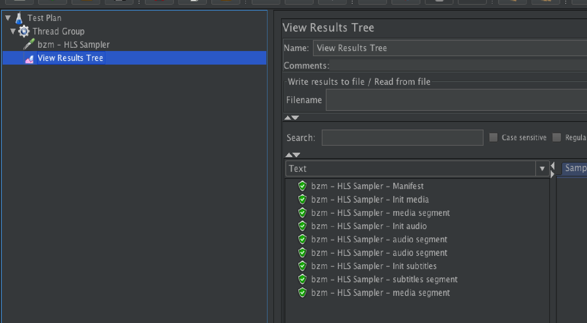

In the case of MPEG DASH, the View Results Tree Listener displays the resultant samples with the associated type (manifest, inits and segments for media, audio and subtitles) to easily identify them as well.

## Running periodic requests during playback (Streaming Parallel Controller)

### Concept

Many streaming clients fire a periodic "heartbeat" (analytics beacon, session keep-alive, DRM/license ping, etc.) while the video keeps playing. The **bzm - Streaming Parallel Controller** reproduces that behavior without the CPU and memory cost of the JMeter Parallel Controller: instead of spawning extra threads and deep-cloning the sub-tree, it runs the playback and the heartbeat on the **same thread** by time slicing the playback. Between heartbeats the Streaming Sampler plays in short, resumable slices; every configured interval the controller pauses playback at a slice boundary, runs the heartbeat branch once, and then resumes playback exactly where it left off (no re-download of the master/media playlists or manifest).

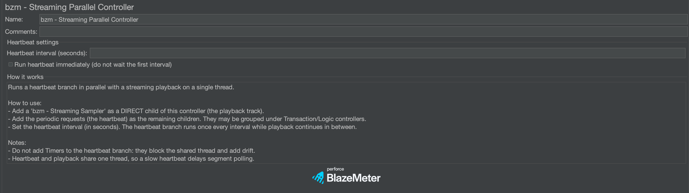

### To add it to your test

- Add the controller: Add -> Logic Controller -> bzm - Streaming Parallel Controller
- Add a **bzm - Streaming Sampler** as a **direct child** of the controller. This is the playback track.
- Add the periodic requests (the heartbeat) as the remaining children. They can be plain HTTP Samplers or grouped under a Transaction/Logic Controller.

The test tree looks like this:

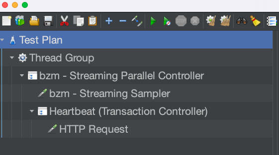

### Controller configuration

#### Heartbeat interval

Set how often (in seconds) the heartbeat branch runs while playback continues in between. For example, `10` fires the heartbeat branch once every 10 seconds of playback.

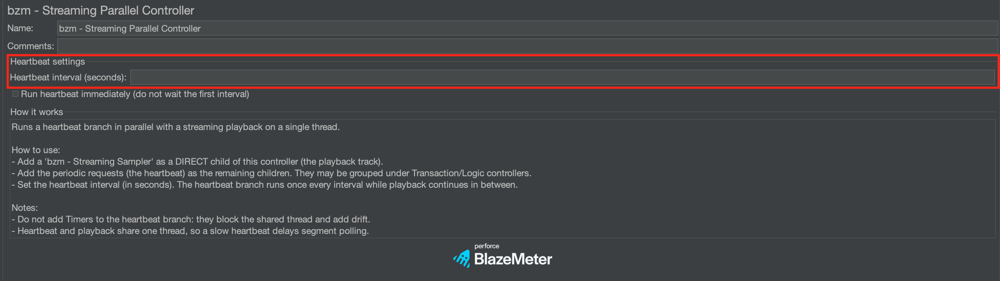

#### Run heartbeat immediately

When enabled, the heartbeat branch runs once at the very start of the iteration (before the first interval elapses). When disabled (default), the controller waits one full interval before the first heartbeat.

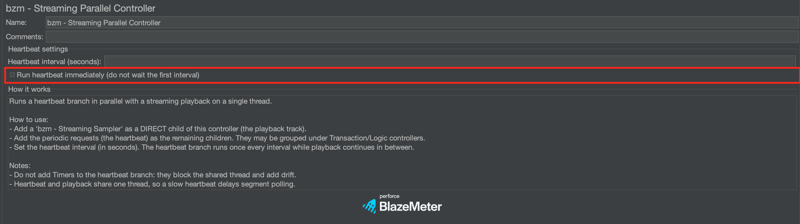

### Results

The Streaming Sampler still emits its usual master/media/segment samples, and the heartbeat branch emits its own samples interleaved with them, so in the View Results Tree you see the heartbeat requests appear roughly every interval, in between the segment downloads of a single ongoing playback.

> [!NOTE]
> **Limitations**
> - The Streaming Sampler must be a **direct child** of the controller. Do not wrap it in a Transaction Controller, or you would get one tiny transaction per playback slice. If no direct-child Streaming Sampler is found, the controller emits a single failed sample so the misconfiguration is visible.
> - Heartbeat and playback share **one thread**. A slow heartbeat (large body / slow server) delays segment polling, so this is best suited to small beacon-style requests. For very short intervals (5-10s) on slow networks, a heartbeat may slip by up to one segment download, since a segment download in progress is not interrupted mid-request.
> - Do **not** add Timers to the heartbeat branch: they block the shared thread and add drift.
> - The heartbeat interval controls when the branch runs **once**; all samplers under it run sequentially each time. To spread requests evenly, structure the branch accordingly.
> - Nesting one Streaming Parallel Controller inside another is not supported (the inner one logs a warning and runs its children without independent slicing).

## Memory tuning: response data release

To reduce JVM memory usage during large/long load tests, the sampler can release
in-memory response bodies after each sample has been measured and passed to
listeners. Two JMeter properties control this behavior (both read once at first
use and cached for the JVM lifetime — they cannot be changed mid-run via
`${__setProperty()}` without restarting JMeter):

### Segment bodies (default: release enabled)

    hls.sampler.releaseSegmentResponseData=true   # default

What it affects:

- Applies to HLS and DASH **media and init segment** samples.
- Performance metrics are NOT affected: bytes received, latency, throughput, response
  codes, headers (including `X-MEDIA-SEGMENT-DURATION`) and download order are all preserved.
- Only the raw segment **payload bytes** are dropped.

When to disable (set to `false` in `user.properties` or via `-J`):

- You need to inspect or assert on the actual segment binary content.

    jmeter -Jhls.sampler.releaseSegmentResponseData=false ...

### Playlist and manifest bodies (default: release disabled)

    hls.sampler.releasePlaylistResponseData=false   # default

What it affects:

- Applies to HLS **master/media/audio/subtitle playlists** and DASH **manifest**
  samples on the playback loop (the 3-arg `downloadPlaylist` path used during sampling).
- Variant-discovery requests (`getVariants` / GUI "Load Playlist") are not affected.
- Playlists and manifests are small; enable only when you want to trim retained
  `SampleResult` text during long soaks.

When to enable:

    jmeter -Jhls.sampler.releasePlaylistResponseData=true ...

### GUI / View Results Tree caveat (both properties)

Response bodies are cleared synchronously right after listeners are notified.
In **GUI mode** with "Save Response Data" enabled, View Results Tree renders
bodies lazily when you click a row — after the body has already been cleared.
Released samples appear with empty response data in the tree. Use non-GUI mode
for production-like soaks, or disable release when debugging response content.

## Assertions and Post Processors

The plugin supports adding assertions and post processors on any of the potential types of sample results (master playlist, media playlist, media segment, audio playlist, audio segment, subtitles, subtitles playlist and subtitles segment).
To add an assertion or post processor that matches a particular result just use as name suffix `-` plus the type of the sample result which it should assert or post process.

Following is an example of an assertion that applies only to media segments:

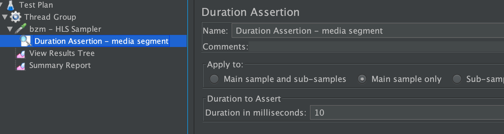

If you want an assertion to apply to all generated sample results, then just use any name that does not include a sample result type suffix.

**Note:** Assertions and post processors will not work for sub results (like redirection sub samples). And selection of samples to apply to (main/sub samples) on assertions and post processors will have no effect.

## Stop/Shutdown Buttons

When you press "Shutdown" button, you may have to wait a relative long time before the test plan actually stops. This may happen due to the behavior of such button, which is to wait for current samples to end (check [JMeter User guide for more details](https://jmeter.apache.org/usermanual/build-test-plan.html#stop)), and HLS sampler may take a relative long time to finish sampling a URL depending on the specified play time and the type of used playlist. For instance, if you set a live stream URL and specify to play the whole video, then it will never end, and doing a shutdown will not stop it.

On the contrary, when "Stop" is pressed, current sample is interrupted (and a failure sample result is be generated) and test plan stops immediately.
