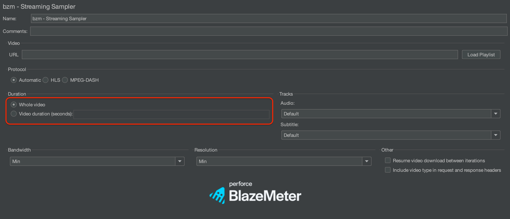
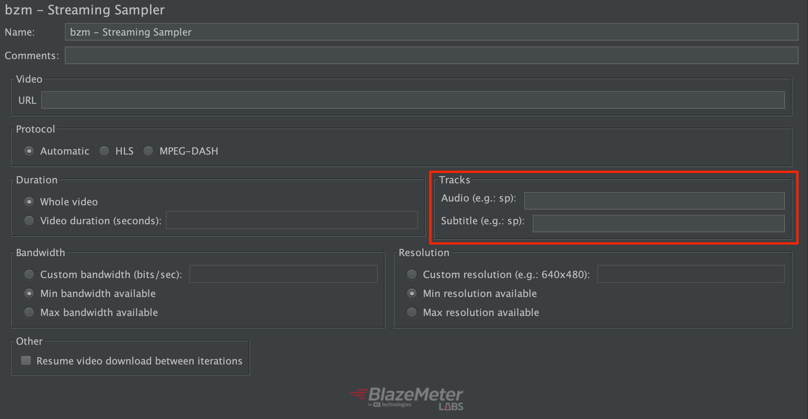
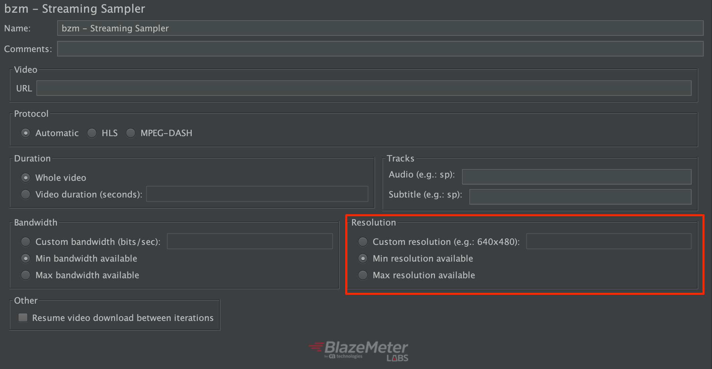
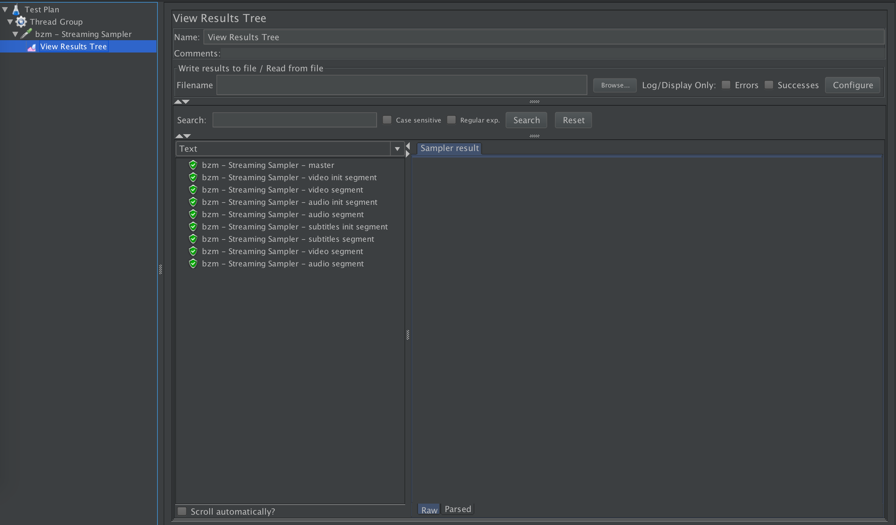

# HLS PLUGIN

The HLS protocol provides a reliable, cost-effective means of delivering continuous and long-form video over the Internet. It allows a receiver to adapt the bitrate of the media to the current network conditions, in order to maintain uninterrupted playback at the best possible quality.

Likewise, trying to provide a wider spectrum of protocols to support videos streaming and video on demand, the plugin also recognizes MPEG-DASH links automatically, without having to point it out in the interface, supporting the downloads of manifests and segments with a predefined resolution and bandwidth.
 
For more information related to HLS, please refer to the  [wikipedia page](https://en.wikipedia.org/wiki/HTTP_Live_Streaming) or to the [RFC](https://tools.ietf.org/html/rfc8216) and, for MPEG DASH, please refer to the [wikipedia page](https://en.wikipedia.org/wiki/Dynamic_Adaptive_Streaming_over_HTTP) or to the [ISO](https://standards.iso.org/ittf/PubliclyAvailableStandards/c065274_ISO_IEC_23009-1_2014.zip).

Currently, the project uses the [HLSParserJ](https://github.com/Comcast/hlsparserj) library to parse the HLS playlists and a [fork](https://github.com/Blazemeter/mpd-tools) of [MPD-Tools](https://github.com/carlanton/mpd-tools) for MPEG-DASH manifest and segments.

**NOTICE**

In future releases, the plugin will be named "Video Streaming Plugin" instead of "HLS Plugin", following the same desire to cover a wider range of protocols.

#### In an HTTP Live Streaming process:

- The audio/video to be streamed is reproduced by a media encoder at different quality levels, bitrates and resolutions. Each version is called a variant.
- The different variants are split up into smaller Media Segment Files.
- The encoder creates a Media Playlist for each variant with the URLs of each Media Segment.
- The encoder creates a Master Playlist File with the URLs of each Media Playlist.
To play, the client first downloads the Master Playlist, and then the Media Playlists. Then, they play each Media Segment declared within the chosen Media Playlist. The client can reload the Playlist to discover any added segments. This is needed in cases of live events, for example.

Notice that the automatic recognition of the HLS protocol is based on the requirement of the URL extension of the Master playlist link, which must have ".m3u8" on it, as specified on the [ISO regulation](https://tools.ietf.org/html/rfc8216#section-4).

#### In a Dynamic Adaptive Streaming over HTTP Live Streaming process:

- The encoder creates a Manifest which contains all the Periods, among Base URLs and the Adaptation Sets to do the filtering, based on resolution, bandwidth and language selector.
- The plugin is coded so it will download the segments, for each Adaptation Set selected, consecutively, instead of doing it in parallel.
- The plugin will update the manifest based on the ```timeShiftBufferDepth``` attribute of MPD.

Notice that, just like is done for HLS, the recognition on this protocol is based on the URL of the Manifest, which should contain ".mpd" on it. In cases, it doesn't meet this requirement, and the url don't contain ".m3a8", it is going to be considered a MPEG-DASH as well.

## How the plugin works

### Concept

This plugin solves the HLS complexity internally. It gets the master playlist file, chooses one variant and gets its media playlist file, the segments, etc. The plugin simulates users consuming media over HLS supporting different situations: stream type, playback time, network bandwidth and device resolution.

Same occurs for MPEG Dash. It gets the Manifest file from the url, chooses an Adaptive set for Media, Audio and Subtitles based on availability, stream type, playback time, network bandwidth and device resolution.


Here is what the Sampler looks like:


### To create your test

- Install the HLS plugin from the Plugins Manager
- Create a Thread Group.
- Add the HLS Sampler Add -> Sampler -> bzm - Streaming Sampler


After that you can add assertions, listeners, etc.

### HLS Sampler configuration

#### Master playlist URL

Set the link to the master playlist file


#### Protocol

Set the protocol you want to test or let the plugin to automatically detect it.


#### Duration

Set the playback time to either the whole video, or a certain amount of seconds.



#### Audio & subtitles tracks

You can specify if you want the plugin to download a specific alternative audio or subtitle track by either the language code or name (e.g. `fr` or `french`).



#### Bandwidth

Select the bandwidth criteria to be used to select a particular variant of the video.


#### Resolution

Select the resolution criteria to be used to select a particular variant of the video. The plugin will consider the bandwidth criteria more important, unless resolution is set to a custom value and bandwidth is not.




#### Resume video downloads

Specify whether you want the playback to be resumed or not between. If you leave the default value, then the plugin will restart playback from the beginning of the stream on each iteration.


## Results

You can set listeners to evaluate the results of your tests. The View Results Tree Listener displays the resultant samples for the HLS samplers so, you can inspect how the requests and responses worked. It will display each one of the samples with the associated type (master playlist, media playlist or video segment) to easily identify them.


The sampler will automatically add an `X-MEDIA-SEGMENT-DURATION` HTTP response header which contains the media segment duration in seconds (in decimal representation). This value can later be used to perform analysis comparing it to the time taken in the associated sample.



In the case of MPEG DASH, the View Results Tree Listener displays the resultant samples with the associated type (manifest, inits and segments for media, audio and subtitles) to easily identify them as well.

## Assertions and Post Processors

The plugin supports adding assertions and post processors on any of the potential types of sample results (master playlist, media playlist, media segment, audio playlist, audio segment, subtitles, subtitles playlist and subtitles segment).
To add an assertion or post processor that matches a particular result just use as name suffix `-` plus the type of the sample result which it should assert or post process.

Following is an example of an assertion that applies only to media segments:


If you want an assertion to apply to all generated sample results, then just use any name that does not include a sample result type suffix.

**Note:** Assertions and post processors will not work for sub results (like redirection sub samples). And selection of samples to apply to (main/sub samples) on assertions and post processors will have no effect.

## Stop/Shutdown Buttons

When you press "Shutdown" button, you may have to wait a relative long time before the test plan actually stops. This may happen due to the behavior of such button, which is to wait for current samples to end (check [JMeter User guide for more details](https://jmeter.apache.org/usermanual/build-test-plan.html#stop)), and HLS sampler may take a relative long time to finish sampling a URL depending on the specified play time and the type of used playlist. For instance, if you set a live stream URL and specify to play the whole video, then it will never end, and doing a shutdown will not stop it.

On the contrary, when "Stop" is pressed, current sample is interrupted (and a failure sample result is be generated) and test plan stops immediately.
