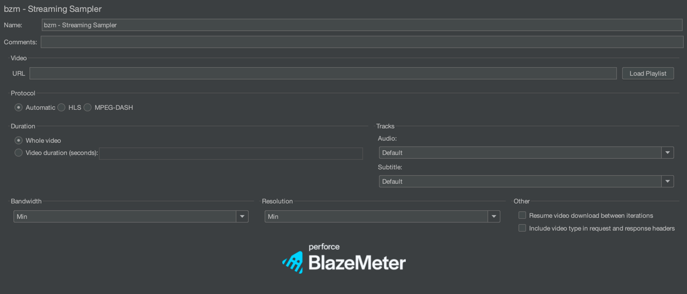
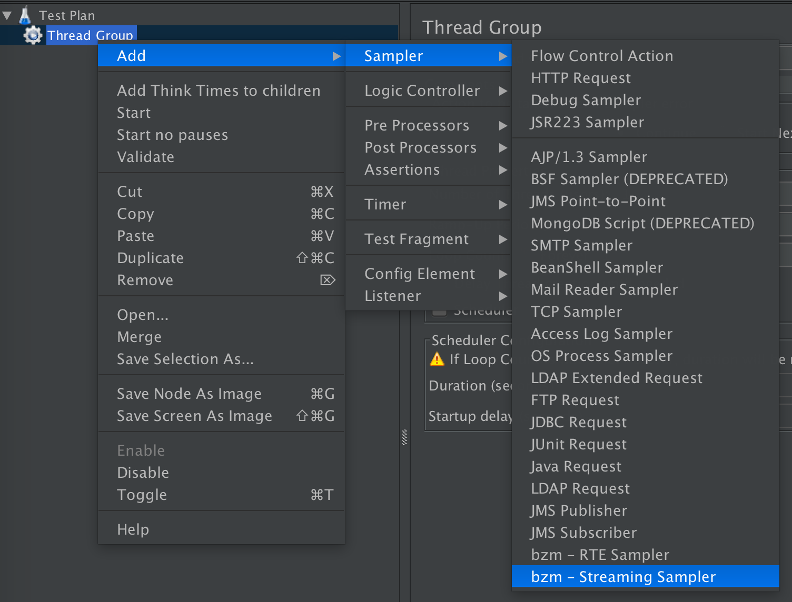
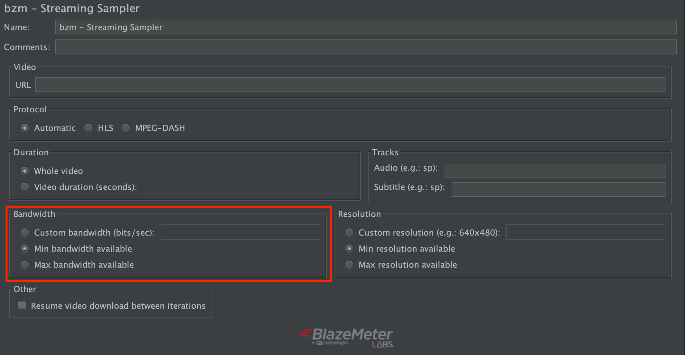
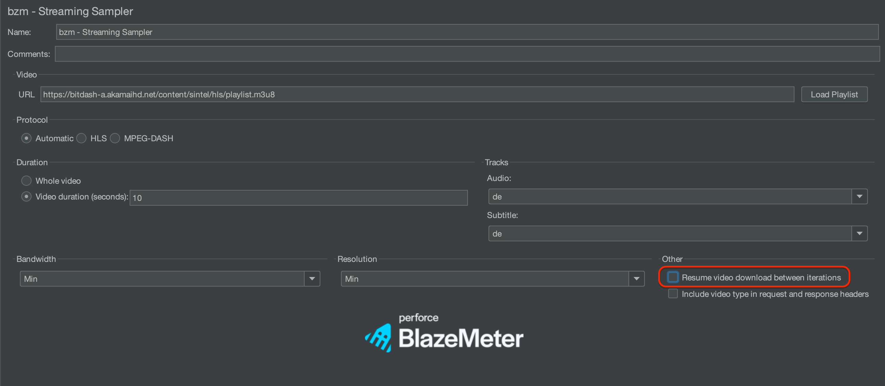
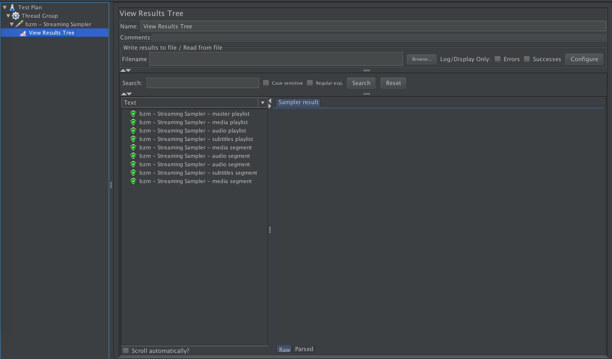
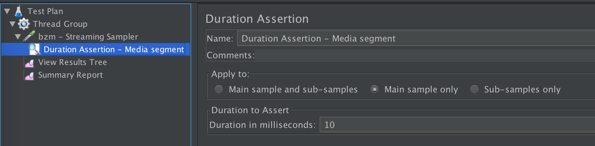

# HLS PLUGIN

The HLS protocol provides a reliable, cost-effective means of delivering continuous and long-form video over the Internet. It allows a receiver to adapt the bitrate of the media to the current network conditions, in order to maintain uninterrupted playback at the best possible quality.

For more information related to HLS, please refer to the  [wikipedia page](https://en.wikipedia.org/wiki/HTTP_Live_Streaming) or to the [RFC](https://tools.ietf.org/html/rfc8216).

Currently the project uses the [HLSParserJ](https://github.com/Comcast/hlsparserj) library to parse the playlists.
#### In a HTTP Live Streaming process:

- The audio/video to be streamed is reproduced by a media encoder at different quality levels, bitrates and resolutions. Each version is called a variant.
- The different variants are split up into smaller Media Segment Files.
- The encoder creates a Media Playlist for each variant with the URLs of each Media Segment.
- The encoder creates a Master Playlist File with the URLs of each Media Playlist.
To play, the client first downloads the Master Playlist, and then the Media Playlists. Then, they play each Media Segment declared within the chosen Media Playlist. The client can reload the Playlist to discover any added segments. This is needed in cases of live events, for example.

## How the plugin works

### Concept

This plugin solves the HLS complexity internally. It gets the master playlist file, chooses one variant and gets its media playlist file, the segments, etc. The plugin simulates users consuming media over HLS supporting different situations: stream type, playback time, network bandwidth and device resolution.

Here is what the HLS Sampler looks like:

### To create your test

- Install the HLS plugin from the Plugins Manager
- Create a Thread Group.
- Add the HLS Sampler Add -> Sampler -> bzm - HLS Sampler

After that you can add assertions, listeners, etc.

### HLS Sampler Properties

The following properties can be set in the HLS Sampler. They should be tuned to simulate the real scenario you want to test.

#### Video options

Set the link to the master playlist file

- URL

#### Play options

Set the playback time of the test:

- Whole video
- Video duration (seconds)

#### Network options

Select the protocol of the playlist you want to test. You can identify it in the link to the master playlist file:

- http
- https

#### Resolution

Select a resolution to simulate your specific device.

#### Bandwidth

After selecting the desired resolution you can select the bandwidth you want to simulate in your test. If there is only one playlist for the selected bandwidth, the plugin will select the playlist based only on this criterion.

- Custom Bandwidth (bits/s)
- Min bandwidth available
- Max bandwidth available

#### Resume video downloads

When iterations are used, the sampler will (by default) start downloading video segments from the beginning of the video for each iteration. It is possible to make the sampler continue in each iteration downloading video segments from the last iteration by checking the "Resume video downloads between iterations" checkbox.

## Results

You can set listeners to evaluate the results of your tests. The View Results Tree Listener displays the resultant samples for the HLS samplers so, you can inspect how the requests and responses worked. It will display each one of the samples with the name of the type it downloaded (master playlist, media playlist or video segment) to identify them.

## Assertions and Post Processors

The plugin supports adding assertions and post processors on any of the potential types of sample results (master playlist, media playlist, media segment, audio playlist, audio segment, subtitles, subtitles playlist and subtitles segment).
To add an assertion or post processor that matches a particular result just use as name suffix `-` plus the type of the sample result which it should assert or post process.

Following is an example of an assertion that applies only to media segments:

If you want an assertion to apply to all generated sample results, then just use any name that does not include a sample result type suffix.

**Note:** Assertions and post processors will not work for sub results (like redirection sub samples).

## Stop/Shutdown Buttons

When you press "Shutdown" button, you may have to wait a relative long time before the test plan actually stops. This may happen since the behavior of such button is to wait for current samples to end (check [JMeter User guide for more details](https://jmeter.apache.org/usermanual/build-test-plan.html#stop)), and HLS sampler may take a relative long time to finish sampling a URL depending on the specified play time and the type of used playlist. For instance, if you set a livestream URL and specify to play the whole video, then it will never end, and doing a shutdown will not stop it.

On the contrary, when "Stop" is pressed, current sample is interrupted (and a failure sample result is be generated) and test plan stops immediately.

